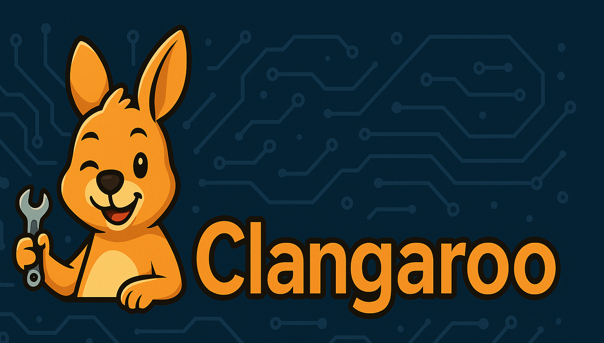

##**🦘 Clangaroo: Lightning-fast C++ code intelligence for LLMs via MCP**

[](https://opensource.org/licenses/MIT)
[](https://www.python.org/downloads/)
[](https://clangd.llvm.org/)
[](http://coff.ee/jasondk)

## ✨ About

Clangaroo enables [Claude Code](https://www.anthropic.com/claude-code), [Gemini CLI](https://blog.google/technology/developers/introducing-gemini-cli-open-source-ai-agent/), and other coding agents to jump around your C++ codebase with ease. Clangaroo provides fast, direct lookup of C/C++ symbols, functions, definitions, call hierarchies, type hierarchies, and more by your bestest LLM pals.

Clangaroo combines the speed of [Tree-sitter](https://tree-sitter.github.io/tree-sitter/) parsing with the accuracy of [clangd LSP](https://clangd.llvm.org), optionally enhanced by [Google Gemini Flash](https://deepmind.google/models/gemini/flash/) AI for deeper insights. **Let your AI buddies spend more time coding and less time stumbling around.**

**But WHY did you make this?** I ❤️ using Claude Code, but every time it auto-compacts and then starts grepping around for the function we've been working on for forever, I die a little bit inside. **But aren't there already a few MCPs that do this** - why do we need another? I spent some time searching and found both [MCP-language-server](https://github.com/isaacphi/mcp-language-server) and [Serena](https://github.com/oraios/serena), which both look perfectly nice! Unfortunately, neither worked for me 😭

Clangaroo is meant to be super simple and is intended to 'just work'.

## 📚 Table of Contents

- [🚀 Quick Start](#-quick-start)
- [🎯 Features](#-features)
- [💬 Usage Examples](#-usage-examples)
- [🛠️ Available Tools](#️-available-tools)
- [🤖 AI Features (Optional)](#-ai-features-optional)
- [⚙️ Configuration Reference](#️-configuration-reference)
- [📋 Requirements](#-requirements)
- [🔧 Troubleshooting](#-troubleshooting)
- [📄 License](#-license)
- [🙏 Acknowledgments](#-acknowledgments)


## 🚀 Quick Start

### 1. Install Clangaroo

```
git clone https://github.com/jasondk/clangaroo
cd clangaroo
pip install -e .
```

### 2. Special compilation step for your C++ project

The clang LSP needs you to do this once:

```bash
# For Makefile-based projects
make clean
compiledb make

# (Some people prefer using 🐻)
bear -- make
```

```bash
# For CMake projects
cmake -B build -DCMAKE_EXPORT_COMPILE_COMMANDS=ON
cp build/compile_commands.json .
```

This will create a special `compile_commands.json` file in your project root.

### 3. Configure Claude Desktop or other MCP client

Did you know you can now [add MCP servers](https://lmstudio.ai/docs/app/plugins/mcp) to [LM Studio](https://lmstudio.ai)?

<summary>🎯 Recommended configuration with AI:</summary>

**N.B.: Use of `--ai-enabled` will use Google Gemini and will incur a small cost via your Gemini API key, if provided. This is usually very minor as long as you use Gemini Flash or Flash Lite.**

**Note:** Please replace 'command' and 'project' with correct paths for your system, and replace `your-google-ai-api-key` with your API key (if using one). If you don't wish to use the AI enhanced services, simply leave out all the `--ai` options and the API key.<BR>

```
{
  "mcpServers": {
    "clangaroo": {
      "command": "/usr/local/bin/clangaroo",
      "args": [
        "--project", "/path/to/your/cpp/project",
        "--warmup",
        "--warmup-limit", "10",
        "--log-level", "info",
        "--ai-enabled",
        "--ai-provider", "gemini-2.5-flash",
        "--ai-cache-days", "14",
        "--ai-cost-limit", "15.0",
        "--call-hierarchy-depth", "10",
        "--ai-analysis-level", "summary",
        "--ai-context-level", "minimal"
      ],
      "env": {
        "CLANGAROO_AI_API_KEY": "your-google-ai-api-key"
      }
    }
  }
}
```

<details>
<summary>📍 Claude Desktop config file locations</summary>

- **macOS**: `~/Library/Application Support/Claude/claude_desktop_config.json`
- **Windows**: `%APPDATA%\Claude\claude_desktop_config.json`

</details>

  Default depth of AI analysis (`--ai-analysis-level`, default: `summary`).<BR>
  - `summary`: Quick overview with key points<BR>
  - `detailed`: Comprehensive analysis with examples and context<BR>
<BR>
  Default depth of context (`--ai-context-level`, default: `minimal`).<BR>
  - `minimal`: Just the symbol and immediate documentation<BR>
  - `local`: Include surrounding code in the same file<BR>
  - `full`: Include dependencies and related files<BR>

### 4. Restart Claude Desktop

Quit and restart Claude. You're ready to explore your C++ code! 🎉

### 5. Add MCP server to Claude Code
``` claude mcp add-from-claude-desktop``` (and make sure `clangaroo` is checked)<BR>

**OR**<BR>

```claude mcp add /usr/local/bin/clangaroo --project /path/to/your/cpp/project --warmup --warmup-limit 10 --log-level info --ai-enabled --ai-provider gemini-2.5-flash --ai-cache-days 14 --ai-cost-limit 15.0 --call-hierarchy-depth 10 --ai-analysis-level summary --ai-context-level minimal --name clangaroo --env CLANGAROO_AI_API_KEY=your-google-ai-api-key```

## 🎯 Features

- ⚡ **Ultra-Fast Navigation**: Fast response times for code structure queries
- 🔍 **Smart Symbol Search**: Hybrid Tree-sitter + clangd search with automatic fallback
- 📊 **Deep Code Analysis**: Call hierarchies, type hierarchies, and reference tracking
- 🤖 **AI-Powered Insights**: Documentation summarization, pattern detection, and architectural analysis
- 💪 **Robust**: Works even with compilation errors thanks to Tree-sitter fallback
- 🚀 **Zero Configuration**: Just point to a project with `compile_commands.json`

## 💬 Usage Examples

This is really meant for coding agents like Claude Code more than you, but if you want to use it, you can just talk to your LLM naturally about your code once the MCP server is hooked up:

```
"Uncover the cryptic lair where the `UserManager` class is conjured from the void."  
"Reveal every shadowy corner that invokes the dreaded `summonSoulPayment()` ritual."  
"Expose the unholy powers inherited by the `DatabaseConnection` class from its ancient ancestors."  
"Dissect the twisted call hierarchy of `unleashChaos()` and narrate the program's descent into madness."
#YMMV
```

## 🛠️ Available Tools

| Tool Category | Tools | Description |
|---------------|-------|-------------|
| **🔍 Discovery** | `cpp_list_files`<br>`cpp_search_symbols` | Find files and symbols in your codebase |
| **📍 Navigation** | `cpp_definition`<br>`cpp_references`<br>`cpp_hover` | Jump to definitions, find references, get type info |
| **📞 Call Analysis** | `cpp_incoming_calls`<br>`cpp_outgoing_calls` | Trace function relationships |
| **🏗️ Type Hierarchy** | `cpp_prepare_type_hierarchy`<br>`cpp_supertypes`<br>`cpp_subtypes` | Analyze inheritance |
| **⚡ Structure** | `cpp_list_functions`<br>`cpp_list_classes`<br>`cpp_get_outline`<br>`cpp_extract_signatures` | Fast structural analysis |

## 🤖 AI Features (Optional)

### Setup
1. Get your API key from [Google AI Studio](https://makersuite.google.com/app/apikey)
2. Add to your environment (`bash`):
   ```
   export CLANGAROO_AI_API_KEY="your-api-key"
   ```

### What You Get
- 📚 **Smart Documentation**: Complex C++ docs explained clearly
- 🔍 **Pattern Analysis**: Understand why and how functions are called
- 🏛️ **Architecture Insights**: Identify design patterns automatically
- 💡 **Refactoring Tips**: Get improvement recommendations
- 💰 **Cost Effective**: $3-7/month typical usage with smart caching

## ⚙️ Configuration Reference

<details>
<summary>View all configuration options</summary>

### Basic Options
- `--project PATH` - Path to C++ project root (required)
- `--log-level LEVEL` - Logging verbosity: debug, info, warning, error
- `--timeout SECONDS` - LSP request timeout (default: 5.0)

### Performance Options
- `--warmup` - Pre-warm the index by opening key files
- `--warmup-limit N` - Number of files to warm up (default: 10)
- `--wait-for-index` - Wait for clangd indexing to complete
- `--index-timeout SECONDS` - Timeout for index wait (default: 300)
- `--index-path PATH` - Custom clangd index location

### AI Options
- `--ai-enabled` - Enable AI features
- `--ai-provider PROVIDER` - AI provider: gemini-2.5-flash or gemini-2.5-flash-lite
- `--ai-api-key KEY` - Google AI API key
- `--ai-cache-days DAYS` - Cache AI summaries for N days (default: 7)
- `--ai-cost-limit AMOUNT` - Monthly cost limit in USD (default: 10.0)
- `--ai-analysis-level LEVEL` - Default analysis depth: summary or detailed
- `--ai-context-level LEVEL` - Code context depth: minimal, local, or full

### Call Hierarchy Options
- `--call-hierarchy-depth DEPTH` - Maximum depth (1-10, default: 3)
- `--call-hierarchy-max-calls NUM` - Total call limit (default: 100)
- `--call-hierarchy-per-level NUM` - Calls per depth level (default: 25)

</details>

## 📋 Requirements

- Python 3.10+
- clangd 16+ (`brew install llvm` or `apt install clangd`)
- C++ project with `compile_commands.json`
- (Optional) Google AI API key for AI features

## 🔧 Troubleshooting

<details>
<summary>Claude doesn't see the tools</summary>

1. Check the config file location and JSON syntax
2. Use absolute paths in the configuration
3. Restart Claude Desktop completely
4. Check logs with `--log-level debug`

</details>

<details>
<summary>No results from queries</summary>

1. Verify `compile_commands.json` includes the files
2. Wait for indexing: add `--wait-for-index` flag
3. Test clangd directly: `clangd --check=file.cpp`

</details>

<details>
<summary>Performance issues</summary>

- Enable warmup: `--warmup --warmup-limit 30`
- Use shared index: `--index-path /shared/clangd-index`
- Reduce call hierarchy depth for large codebases

</details>

## 📄 License

[MIT License](LICENSE) - see the file for details.

## 🙏 Acknowledgments

- [clangd](https://clangd.llvm.org/) for C++ language server
- [Tree-sitter](https://tree-sitter.github.io/) for syntax parsing
- [MCP](https://modelcontextprotocol.io/) for the protocol specification
- [Google Gemini](https://ai.google.dev/) for AI capabilities

---
